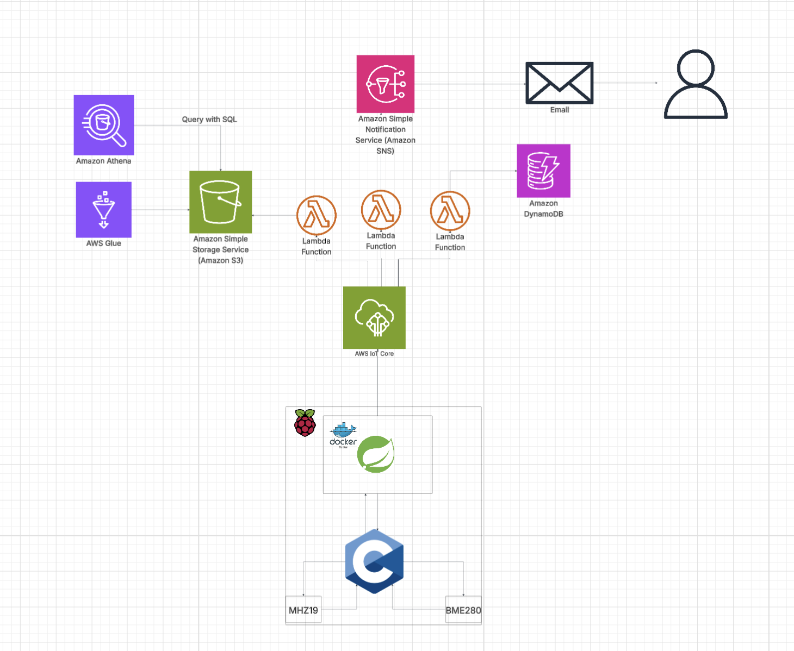

# EnvTracker

**EnvTracker** is a smart environmental monitoring platform built with **Spring Boot**, **AWS Lambda**, and a **Raspberry Pi**.  
It collects real-time environmental data using **BME280** (temperature, humidity, pressure) and **MH-Z19** (CO₂) sensors and securely sends these readings to the cloud through **AWS IoT Core**.

A hybrid backend consisting of **Spring Cloud Function** and **three AWS Lambda functions** processes, stores, analyzes, and alerts on incoming environmental data.

---

## Features
- Real-time monitoring of temperature, humidity, pressure, and CO₂ levels  
- Secure IoT MQTT communication via **AWS IoT Core**  
- **Three AWS Lambda functions** for data storage, analytics, and alerting  
- Automatic email notifications when environmental conditions exceed safe ranges  
- Fast historical lookups with **AWS DynamoDB**  
- Long-term analytics through **S3 + AWS Glue + Amazon Athena**  
- Modular backend built with **Spring Cloud Function**  

---

## System Architecture

### 1. **Raspberry Pi**
Collects environmental sensor data using:
- **BME280** – Measures temperature, humidity, and pressure  
- **MH-Z19** – Measures CO₂ concentration  

The device publishes sensor readings to **AWS IoT Core** using an MQTT topic.

---

### 2. **AWS IoT Core**
- Provides secure communication between the Raspberry Pi and the backend  
- Routes incoming IoT messages to:
  - **Spring Cloud Function**
  - **Three AWS Lambda functions** for specialized processing

---

### 3. **Backend Processing**

### **A. Spring Cloud Function**
Acts as the main application logic layer:
- Receives IoT messages  
- Performs validation, normalization, and enrichment of sensor data  
- Coordinates downstream processing  

---

### **B. AWS Lambda Functions**

#### **1. DynamoDB Writer Lambda**
- Saves each incoming sensor reading into a DynamoDB table  
- Enables fast lookups and real-time dashboards  
- Supports alerting and historical trend analysis  

#### **2. S3 Storage Lambda (Analytics Pipeline)**
- Stores each reading into an S3 bucket in partitioned folders (e.g., `/year/month/day/`)  
- AWS Glue Crawler updates a schema for the stored data  
- **Amazon Athena** is used to run SQL queries on the sensor history  
- Ideal for long-term analytics, batch analysis, and ML workloads  

#### **3. Alerting Lambda (SNS Email Notifications)**
- Evaluates readings to detect abnormal or unsafe environmental conditions  
- Publishes alert messages to **AWS SNS**, which sends formatted alert emails  
- Used for rapid detection of air quality issues (high CO₂, extreme temperature, etc.)

---

## Technologies Used
- **Java 17**  
- **Spring Boot**  
- **Spring Cloud Function**  
- **AWS Lambda**  
- **AWS IoT Core (MQTT)**  
- **AWS SNS**  
- **AWS DynamoDB**  
- **AWS S3 + AWS Glue + Amazon Athena**  
- **Raspberry Pi**  
- **BME280 & MH-Z19 sensors**  
- **Maven**

---

## Future Enhancements
- Web dashboard with real-time charts  
- Predictive environmental anomaly detection (ML-based)  
- Additional sensors (VOC, particulate matter, air quality index)  
- Mobile notifications (SNS SMS or push notifications)

---

## License
MIT License

---

## Author
Jaber Rantisi  
